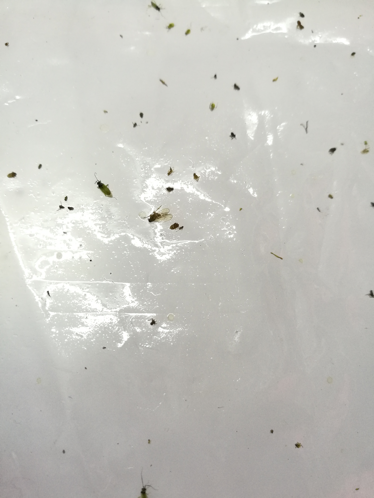

Blog features are powered by the blog plugin. Simply add files to the `blog` directory. It supports tags as well!

<!--truncate-->



```javascript
var s = "JavaScript syntax highlighting";
alert(s);
```

beberapa code dari python

```python
s = "Python syntax highlighting"
print(s)
```

Delete the whole directory if you don't want the blog features. As simple as that!
